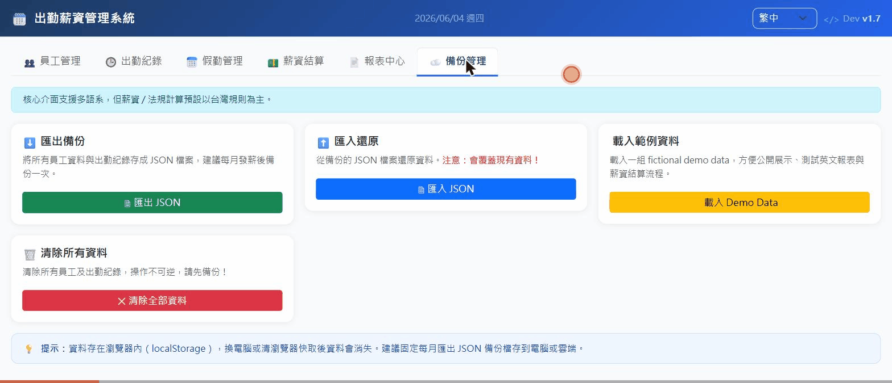
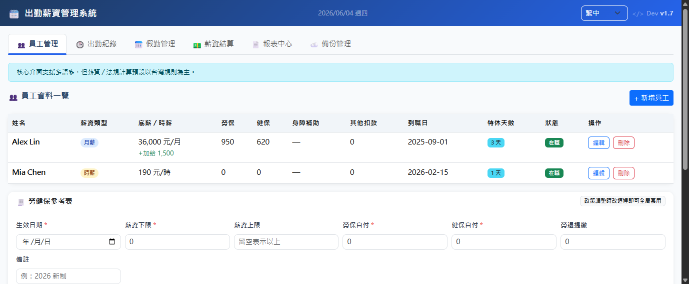
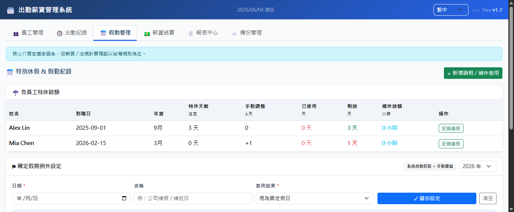

# 出勤薪資管理系統 · Attendance Payroll Offline

> 免費・免安裝・免伺服器 — 小公司的差勤薪資管理，開一個 HTML 就能用。
> Free, zero-install, no server required — HR & payroll for small teams in a single HTML file.

[](LICENSE)
[](src/index.html)
[](#quick-start)
[](#quick-start)
[](#features)
[](CHANGELOG.md)

<p align="center">
  <a href="https://charge717.github.io/attendance-payroll-offline/"><strong>Try the demo</strong></a>
  ·
  <a href="src/index.html"><strong>Download the single HTML app</strong></a>
  ·
  <a href="docs/manual.zh-TW.html">中文手冊</a>
  ·
  <a href="docs/manual.en.md">English manual</a>
</p>

> Demo runs entirely in your browser. Use **備份管理 → 載入 Demo Data** to load fictional sample records safely.
> The app never uploads employee or payroll data by default.

---



## 📸 畫面預覽

| 員工管理 | 薪資結算 | 假勤管理 |
|---------|---------|---------|
|  |  |  |

---

## 為什麼選這個工具？

| | 本工具 | 一般 SaaS 系統 |
|---|---|---|
| 費用 | ✅ 完全免費 | ❌ 月費制 |
| 安裝需求 | ✅ 只需瀏覽器 | ❌ 需要帳號/伺服器 |
| 資料位置 | ✅ 你的電腦，你說了算 | ❌ 存在別人的雲端 |
| 離線使用 | ✅ 完全支援 | ❌ 斷網就失效 |
| 台灣勞保健保計算 | ✅ 內建參考表 | ❌ 需要額外設定 |
| 客製化自由度 | ✅ 開源 MIT | ❌ 受限於供應商 |

---

## ✨ 功能一覽

### 員工與出勤
- 月薪制 / 時薪制員工資料管理
- 出勤紀錄：遲到、早退、正常工時自動計算
- 加班費計算（平日加班、週六加班、國定假日）
- 午休時段自動抵扣，不誤算遲到/早退
- 出勤異常與漏打卡警示

### 假勤管理
- 支援：特休、事假、病假、生理假、喪假、補休、其他假
- 半日假搭配出勤自動互相抵扣，不重複扣薪

### 薪資結算
- 月底一鍵結算，自動套用勞保、健保、勞退參考表
- 手動加項 / 減項（伙食津貼、其他費用等）
- 全體員工當月薪資總覽（結算人數、實發合計）
- 薪資單列印 / `.xlsx` 匯出

### 資料安全
- 所有資料存在你的瀏覽器本機，不會上傳任何伺服器
- JSON 備份 / 還原，換電腦照常使用
- 內建 Demo 假資料，可安全公開展示

### 開發品質
- 薪資計算回歸測試（Node.js）
- 推送前隱私掃描腳本
- i18n 靜態 UI 稽核，雙語介面一致性保障

---

## 🚀 30 秒快速開始

1. **線上試用**：點擊 [Try the demo](https://charge717.github.io/attendance-payroll-offline/)
2. **下載主程式**：點擊 [`src/index.html`](src/index.html) → 右鍵 → 另存新檔
3. **用瀏覽器打開**：雙擊下載的 `index.html`
4. **開始使用**：不需要安裝任何東西 ✅

> 第一次使用？點上方「備份管理」分頁 → 點「載入 Demo Data」，5 秒內看到完整功能。

---

## 開發指令

```bash
# 執行薪資計算回歸測試
node --test tests/payroll-calculation.test.js

# 推送前隱私掃描（確保未誤提交薪資資料）
npm run privacy:audit

# i18n 雙語 UI 稽核
npm run i18n:audit
```

---

## 📂 專案結構

```
attendance-payroll-offline/
├── src/
│   └── index.html          ← 主程式（單一 HTML 直接開啟）
├── docs/
│   ├── manual.zh-TW.html   ← 繁體中文使用手冊
│   ├── manual.zh-TW.pdf    ← 可列印版手冊
│   ├── manual.en.md        ← English manual
│   ├── spec.zh-TW.md       ← 系統規格書
│   └── architecture.md     ← 架構說明
├── tests/
│   └── payroll-calculation.test.js
├── scripts/
│   ├── privacy-audit.js
│   └── i18n-audit.js
├── CHANGELOG.md
└── CONTRIBUTING.md
```

---

## 📖 文件

| 文件 | 連結 |
|------|------|
| 繁體中文使用手冊 | [docs/manual.zh-TW.html](docs/manual.zh-TW.html) |
| 可列印 PDF 手冊 | [docs/manual.zh-TW.pdf](docs/manual.zh-TW.pdf) |
| English Manual | [docs/manual.en.md](docs/manual.en.md) |
| 系統規格書 | [docs/spec.zh-TW.md](docs/spec.zh-TW.md) |
| 變更紀錄 | [CHANGELOG.md](CHANGELOG.md) |
| 架構說明 | [docs/architecture.md](docs/architecture.md) |
| 國際化說明 | [docs/i18n.md](docs/i18n.md) |

---

## 🛡️ 隱私與資料

這是離線優先工具。所有員工與薪資資料只存在你的瀏覽器本機，不會傳送到任何伺服器、雲端或第三方。

**請定期匯出 JSON 備份**，尤其是換電腦或清除瀏覽器資料前。

---

## 🤝 貢獻

歡迎以下類型的貢獻：

- 🌐 其他語言翻譯（目前支援繁中 / 英文）
- 🧪 測試案例補充
- ♿ 無障礙改善
- 📝 文件與使用案例

詳見 [CONTRIBUTING.md](CONTRIBUTING.md)。

---

## License

[MIT License](LICENSE) — 自由使用、修改、分發，包含商業用途。

---

<div align="center">

如果這個工具對你有幫助，歡迎給個 ⭐ Star — 讓更多小公司老闆看到它！

*If this tool helped you, a ⭐ Star goes a long way!*

</div>
